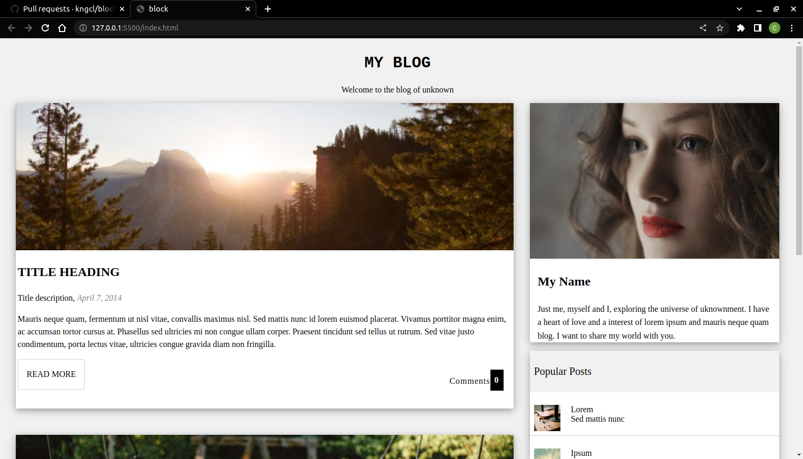

# BLOG TEMPLATE

Talks about the personality and observation of someone about a place in particular.
has two sections, right sections presenting the speaker and the left section presenting places

## App

### Built With

- HTML
- CSS

### Prerequisites

Knowledge about:
Your desired browser.
  
## Clone project

- To get a local copy up and running follow these simple example steps.
- Clone this repository with `https://github.com/clint360/blogtemplate.git` using your terminal.
- Change to the project directory by entering: cd block in the terminal.

## steps

- $ git clone `https://github.com/clint360/blogtemplate`
- $ `cd blogtemplate`
- $ `git checkout feature/footer`

## Start App

- run by opening the index.html in the browser

## Author

👤 **clint360**

- GitHub: [@clint360](https://github.com/clint360)

## 📝 License

This project is [w3school](./LICENSE) licensed.
